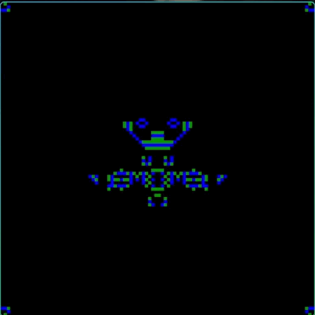

# Conway's Game of Life

Implementación del laboratorio de renderizado en tiempo real usando Rust y
Raylib.



## Ejecutar

Desde la raíz del proyecto:

```bash
cargo run
```

La simulación utiliza un framebuffer lógico de **100 × 100** que se escala a
una ventana de **800 × 800**. Cada generación se muestra cada **200 ms**.

## Implementación

- Cada célula viva se dibuja mediante `Framebuffer::set_pixel` (la función de
  puntos del framebuffer del tutorial).
- `get_color` permite leer el estado de cada célula.
- Las ocho vecinas se cuentan antes de modificar el framebuffer, por lo que
  todas las células avanzan simultáneamente a la siguiente generación.
- Las células nacidas por reproducción se muestran en verde.
- Las células que sobreviven se muestran en azul.
- Las células muertas se muestran en negro.
- Las orillas se consideran células muertas.
- El framebuffer no se limpia entre frames; cada célula se actualiza según la
  generación calculada.

## Patrón inicial

El patrón de `initial_pattern` forma la palabra `Ylime`, incluye una nave y
gliders ubicados en las esquinas. Los píxeles iniciales se agregan con:

```rust
framebuffer.set_pixel(x, y);
```

Las coordenadas válidas son `x = 0..99` y `y = 0..99`.
